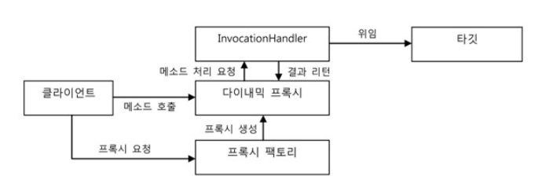
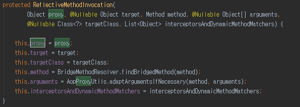

# JPA 세미나 준비

- 목차
  - JPA Lazy loading 
    - JPA lazy loading 간단 설명
    - 동작 원리
    - 코드
  - Dirty Check
    - Dirty check 란
    - 동작 원리
    - 코드

## Lazy loading
쉽게 말해 Lazy loading 은 필요할 때까지 객체 초기화를 지연하기 위해 사용하는 디자인 패턴이다. 

JPA 에서는 어떻게 사용되는지 아래를 보고 확인해보자.


아래의 로그처럼 실제 `List<UserConnected>` 에 접근했을 때 `SELECT` query 가 수행되는 것을 볼 수 있다.

----

`hibernate 완벽 가이드` 책을 인용했을 때 다음과 같은 내용을 볼 수 있다.

> load() 연산 후 메모리 상에 있는 것은 영속 item 객체가 아니다. SQL 도 실행되지 않았다. 하이버네이트가 실제 객체처럼 보이는 프록시를 생성했을 뿐이다.

보통 책이나 블로그에선 lazy loading 은 프록시를 이용해 구현을 했다고 한다. 하지만 `이 프록시가 과연 어떤 프록시인가?` 에 대해서는 나와있지 않다. 

---

### 프록시란
일반적으로 말하는 프록시는 클라이언트와 사용 대상 사이의 대리 역할을 맡은 오브젝트를 두는 방법을 말한다. 

프록시 패턴의 프록시는 프록시를 사용하는 방법 중에서 타깃에 대한 접근 방법을 제어하려는 목적을 가진 경우를 말한다. 그래서 target 의 기능을 확장, 추가하지 않는다.

`target object` 를 필요한 시점까지 생성하지 않고 있다가 `target object` 에 대한 `reference` 가 필요하면 `프록시 패턴`을 적용했을 때 이게 바로 `lazy loading` 이다.

클라이언트에게 target 에 대한 reference 를 넘기는 대신 프록시를 넘기고 해당 target 을 사용하려 할 때 프록시가 target object 를 생성하고 요청을 위임해 주는 방식이다.

---

책이나 구글링을 통해 나오는 `프록시`가 어떤 것이며, 어떻게 동작을 하는지 알아보도록 하겠다.

위에서 보았던 `lazy_loading_JPA()` 테스트 메소드를 이용해서 알아보도록 하겠다.

우선 다음의 코드에 브레이크 포인트를 걸었다.

```
User user = userRepository.findById(595525L)
        .orElseThrow(() -> new IllegalArgumentException("데이터가 존재하지 않습니다."));
```


사진을 보다시피 바로 `JdkDynamicAopProxy` 클래스의 `invoke()` 메소드로 접근 하는 것을 볼 수 있다.
`JdkDynamicAopProxy` 클래스는 `org.springframework.aop.framework` 에서 제공하는 클래스이다. 

### DynamicProxy
`DynamicProxy` : 프록시 팩토리에 의해 런타임 시 다이나믹하게 만들어지는 오브젝트이다. `Dynamic Proxy Object` 는 target 의 `interface` 와 같은 타입으로 만들어진다.

Spring aop 에서는 `DefaultAopProxyFactory` 클래스를 제공하여 `DynamicAopProxy` 를 생성한다.



클라이언트는 `Dynamic Proxy Object` 를 `target interface` 통해 사용할 수 있는데 해당 프록시를 생성할 때 인터페이스 정보만 제공하면 해당 interface 를 구현한 클래스의 오브젝트를 자동으로 만들어주기 때문에 편리하다.

`Dynamic Proxy` 가 인터페이스 구현 클래스의 오브젝트는 만들어주나, 부가 기능 코드는 직접 생성해야 하는데 이때 부가 기능은 `InvocationHandler` 를 구현해야 한다. 해당 인터페이스는 다음과 같은 메소드 하나만 가지고 있다.

```
package java.lang.reflect;

public Object invoke(Object proxy, Method method, Object[] args) throws Throwable;
```

`invoke()` 메소드는 reflection 의 method 인터페이스를 파라미터로 받고 호출될 때 전달할 파라미터도 `args` 로 받는다. 

즉, `Dynamic Proxy Object` 는 클라이언트의 모든 요청을 reflection 정보로 변환해 해당 `invoke()` 메소드로 넘긴다.

> `DynamicAopProxy` 는 `InvocationHandler` 를 구현하는 final 클래스이다.

---

그리고 실제 `target object` 의 method 를 내부적으로 실행하기 위한 `MethodInvocation` 이 존재한다. 이 `MethodInvocation` 은 `proceed()` 메소드를 호출해 사용한다.

```
// We need to create a method invocation...
invocation = new ReflectiveMethodInvocation(proxy, target, method, args, targetClass, chain);
// Proceed to the joinpoint through the interceptor chain.
retVal = invocation.proceed();
```

위 debugging 사진을 참고하도록 하자. 

즉, 해당 `target(targetClass)` 에 대한 `method(method)` 를 `args(args)` 를 이용해 메소드를 실행한다. 여기서 `chain` 파라미터는 런타임에 필요한 인터셉터를 의 해놓은 list 이다. 

 

다음의 사진을 참고하자.

----

`ReflectiveMethodInvocation` 클래스의 생성자 파라미터에는 다음과 같이 존재한다.



- proxy : 호출한 프록시 객체
- target : 호출하는 target 객체
- method : 호출하는 메소드
- args : 메소드에 사용되는 인자
- targetClass : MethodMatcher 호출의 타겟 클래스
- interceptorsAndDynamicMethodMatchers : 런타임에 필요한 InterceptorAndDynamicMethodMatchers와 함께 적용되어야하는 인터셉터를 정의(잘 이해가 가지 않음)

---

위에서 알아본 방식으로 실제 lazy_loading 을 구현하고 있다. 실제 단순 `findById()` 를 호출해도 `DynamicAopProxy` 로 접근한다. 이렇게 프록시를 이용하기 위해 `JpaRepository Interface` 를 제공하는 것 같기도 하다. (뇌피셜)

간단하게 정리하자면 다음과 같은 순으로 동작하게 된다.

1. DB 에서 데이터 조회 시도
   -  `user.getUserConnectedList()`
2. 해당 코드로 인해 해당 프록시에 요청하게 됨
3. `DynamicAopProxy` 에서 각각 reflection 을 이용해 클래스, 메소드, 인자 정보를 가지게 됨
4. 그러면 해당 proxy 에 설정된 target 에 대한 method 를 호출하게 함
5. 해당 `findById()` 를 `5955525` 라는 인자와 함께 수행하게 됨 (`proceed()`)
6. 실제 collection 을 사용하려고 할 때 select 쿼리가 수행됨으로 써 동작이 가능해짐

